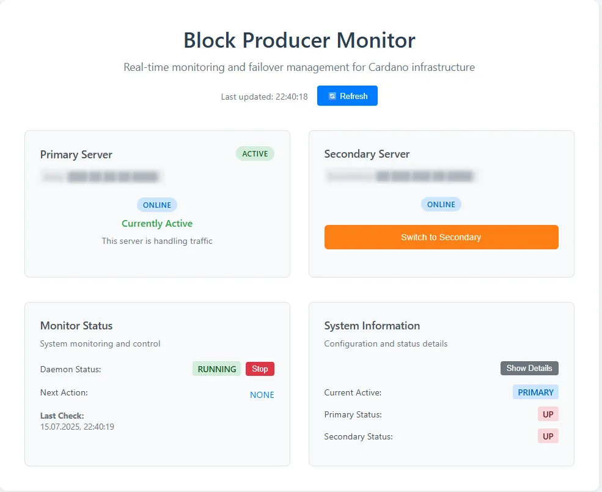

# Block Monitor Backend



[](https://github.com/Cardano-Fans/crfa-block-monitor/actions/workflows/build-and-test.yml)
[](https://github.com/Cardano-Fans/crfa-block-monitor/actions/workflows/integration-tests.yml)

A Quarkus-based Java microservice that monitors Cardano block producer nodes and provides automatic failover capabilities.

## Features

- Health monitoring of primary and secondary Cardano nodes
- Automatic DNS failover when primary node goes down
- Manual switching between nodes with override capability
- RESTful API for status and control
- Configurable timing for failover/failback delays
- Native image support with GraalVM for low resource consumption

## Requirements

- Java 24 LTS
- Gradle 8.14.3+ (uses Gradle wrapper)
- Node.js 22.x LTS and npm 11.4.2+ (for frontend build)
- Docker (for containerized builds)

## Configuration

The application uses different configuration files for different environments:

- **Development**: `src/main/resources/application-dev.yml`
- **Local**: `src/main/resources/application-local.yml`
- **Production**: External config file (e.g., `application-prod.yml`)

Edit the appropriate configuration file to set:
- Server hostnames and ports
- DNS API credentials (Name.com)
- Timing settings for failover/failback
- Logging configuration

## Running

### Development Mode
```bash
./gradlew quarkusDev
```

### Production JAR
```bash
./gradlew build
java -jar build/quarkus-app/quarkus-run.jar
```

### Native Image
```bash
./gradlew build -Dquarkus.native.enabled=true -Dquarkus.package.jar.enabled=false
./build/block-monitor-backend-*-runner
```

### Docker Builds

Two Docker builds are available:

#### JVM Docker Image
```bash
docker build -f Dockerfile.jvm -t block-monitor-backend:jvm .
docker run -p 8080:8080 block-monitor-backend:jvm
```

#### Native Docker Image
```bash
docker build -f Dockerfile.native -t block-monitor-backend:native .
docker run -p 8080:8080 block-monitor-backend:native
```

## API Endpoints

- `GET /api/health` - Health check with HTTP status codes (200=healthy, 500=unhealthy)
- `GET /api/status` - Get current monitoring status with complete server information
- `POST /api/control` - Start/stop monitoring (accepts `{"action": "START|STOP"}`)
- `POST /api/active` - Manual server switching (accepts `{"active": "PRIMARY|SECONDARY"}`)
- `GET /api/dns/current` - Get current DNS record IP and active server type

## Monitoring

The service runs a scheduled task every 60 seconds to check both primary and secondary nodes. When the primary node is down for more than the configured failover delay, it automatically switches DNS to the secondary node.

## Building Native Image

The native image is built using GraalVM 24 LTS and produces a lightweight, fast-starting executable suitable for containers and resource-constrained environments.